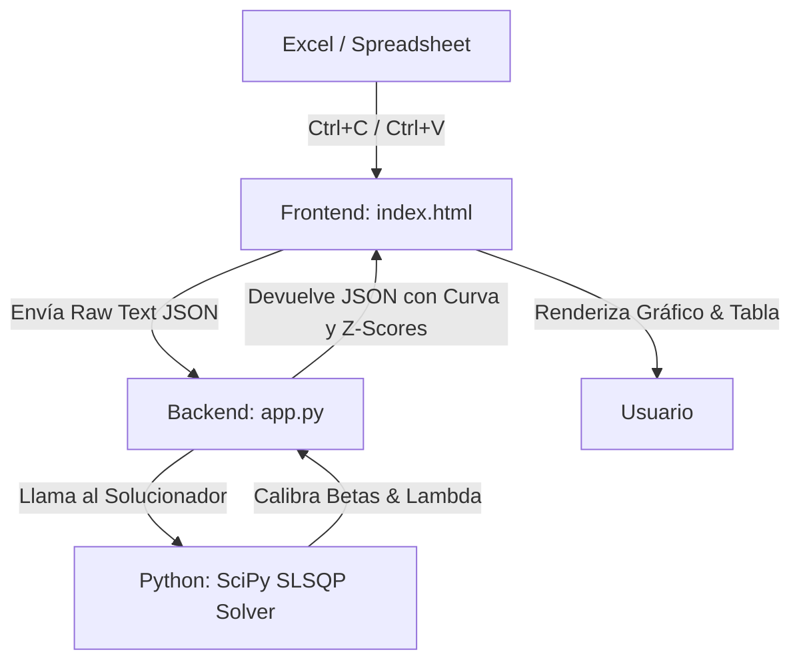

# Presentación Ejecutiva: Curva de Nelson-Siegel & Z-Scores

Esta presentación explica de manera sencilla e intuitiva el funcionamiento del modelo financiero utilizado, cómo se calculan las señales de arbitraje, la formulación matemática de calibración y la tecnología que opera en el fondo.

---

## 1. El Concepto Financiero: ¿Qué estamos resolviendo?

En el mercado financiero, los bonos corporativos o soberanos tienen distintos rendimientos (TIR/TEA) y plazos de vencimiento (Modified Duration). Si graficamos la TIR de todos los bonos en función de su duración, los puntos estarán dispersos:

* **El Problema**: ¿Cómo sabemos si un bono rinde "mucho" o "poco" en comparación con los demás, considerando que tienen duraciones distintas?
* **La Solución**: Construimos una **Curva de Rendimiento Teórica** de referencia. El modelo de **Nelson-Siegel** se encarga de trazar una línea continua "justa" que mejor se adapta a todos los puntos del mercado.

---

## 2. La Fórmula del Modelo Nelson-Siegel

El rendimiento teónico $y(\tau)$ para un plazo $\tau$ (Modified Duration) se define mediante la ecuación:

$$y(\tau) = \beta_0 + \beta_1 \left( \frac{1 - e^{-\tau/\lambda}}{\tau/\lambda} \right) + \beta_2 \left( \frac{1 - e^{-\tau/\lambda}}{\tau/\lambda} - e^{-\tau/\lambda} \right)$$

Los 4 parámetros del modelo tienen una interpretación visual y financiera directa:
1. **$\beta_0$ (Nivel / Largo Plazo)**: 
   - *Qué es*: Representa la tasa de interés de largo plazo (cuando $\tau \to \infty$). 
   - *Efecto*: Desplaza toda la curva hacia arriba o hacia abajo.
2. **$\beta_1$ (Pendiente / Corto Plazo)**: 
   - *Qué es*: Determina el comportamiento a corto plazo. Cuando $\tau \to 0$, la tasa es exactamente $y(0) = \beta_0 + \beta_1$.
   - *Efecto*: Si la pendiente es negativa (normal), la curva arranca abajo y sube hacia el nivel largo. Si es positiva (invertida), arranca arriba y baja.
3. **$\beta_2$ (Curvatura / Mediano Plazo)**: 
   - *Qué es*: Modela el rendimiento a plazos intermedios.
   - *Efecto*: Crea una "panza" o "joroba" en la mitad de la curva. Puede ser positiva (joroba hacia arriba) o negativa (valle hacia abajo).
4. **$\lambda$ (Decaimiento)**:
   - *Qué es*: Controla la velocidad de decaimiento hacia el largo plazo y define la ubicación de la joroba (el pico de la curvatura ocurre aproximadamente en $\tau \approx 1.79 \lambda$).

---

## 3. Metodología de la Regresión (Calibración)

El modelo de Nelson-Siegel **no se puede resolver con una regresión lineal simple de un solo paso** porque el parámetro $\lambda$ está en el exponente ($e^{-\tau/\lambda}$), haciendo que la ecuación sea **no-lineal**.

Para solucionar esto de manera óptima y robusta, el motor en Python realiza una **calibración híbrida en dos etapas**:

### Etapa 1: Linealización y Búsqueda sobre $\lambda$ (Grid Search + OLS)
Si fijamos temporalmente un valor para $\lambda$, los dos términos exponenciales se convierten en variables lineales conocidas para cada bono:
$$X_1(\tau) = \frac{1 - e^{-\tau/\lambda}}{\tau/\lambda}$$
$$X_2(\tau) = X_1(\tau) - e^{-\tau/\lambda}$$

Con esto, la ecuación se transforma en una **Regresión Lineal Múltiple estándar**:
$$y(\tau) = \beta_0 + \beta_1 X_1(\tau) + \beta_2 X_2(\tau)$$

Para cualquier valor candidato de $\lambda$:
1. Construimos la matriz de diseño $X = [1, X_1(\tau), X_2(\tau)]$.
2. Resolvemos los coeficientes óptimos $\beta = (\beta_0, \beta_1, \beta_2)^T$ de forma exacta e instantánea utilizando **Mínimos Cuadrados Ordinarios (OLS)** por álgebra lineal:
   $$\beta = (X^T X)^{-1} X^T y$$
   *(En Python ejecutamos esto usando `numpy.linalg.lstsq`).*
3. Evaluamos la suma de residuos al cuadrado (RSS).

Buscamos el $\lambda$ óptimo en el rango $[0.1, 15.0]$ con un optimizador escalar unidimensional (`scipy.optimize.minimize_scalar`). Esta etapa garantiza encontrar una aproximación global excelente, libre de mínimos locales o malas estimaciones iniciales.

### Etapa 2: Optimización No-Lineal Restringida (SLSQP)
Tomando los parámetros de la Etapa 1 como punto de partida, realizamos una optimización fina y simultánea de las 4 variables ($\beta_0, \beta_1, \beta_2, \lambda$) utilizando el algoritmo **SLSQP (Sequential Least Squares Programming)** en `scipy.optimize.minimize`.

Este método nos permite imponer restricciones financieras estrictas sobre los parámetros:
* **Restricción de Tasa Corta No Negativa**: 
  $$\beta_0 + \beta_1 \ge 0.0165\%$$
  *(Evita que la curva genere tasas nominales negativas a plazo cero al no haber bonos con duración menor a 1 año).*
* **Función de Pérdida con Regularización**:
  El solver minimiza la suma de errores al cuadrado incorporando una pequeña penalización L2 (regularización de Tikhonov) para mantener la estabilidad de los coeficientes:
  $$\min_{\beta_0, \beta_1, \beta_2, \lambda} \sum_{i=1}^N \left( y_i - y(\tau_i; \beta_0, \beta_1, \beta_2, \lambda) \right)^2 + 10^{-6} \times (\beta_0^2 + \beta_1^2 + \beta_2^2)$$

---

## 4. ¿Cómo encontramos los Arbitrajes? (Z-Score)

Una vez que calibramos la curva teórica (la línea de equilibrio del mercado), comparamos la TIR real de cada bono contra el punto exacto de la curva para su misma duración:

1. **Residuo (Spread)**:
   $$\text{Residuo} = \text{TIR Real} - \text{TIR de la Curva}$$
   - Si el Residuo es **positivo**: El bono rinde más que la curva de referencia teórica $\to$ **Está barato (Señal de COMPRA)**.
   - Si el Residuo es **negativo**: El bono rinde menos de lo debido para su duración $\to$ **Está caro (Señal de VENTA)**.
2. **Z-Score (Estandarización)**:
   Para que la comparación sea justa en todo momento, dividimos el Residuo por el desvío estándar de todos los desvíos del mercado. 
   - Un **Z-Score $> +1.5$** indica que el bono está significativamente desviado hacia arriba (muy barato).
   - Un **Z-Score $< -1.5$** indica que el bono está significativamente desviado hacia abajo (muy caro).

---

## 5. ¿Qué hay por detrás? (El Motor Tecnológico)

El sistema opera mediante una estructura de tres capas de software local muy ligera:

### 1. El Cerebro Matemático (Python)
Cuando pegas los datos de Excel, Python procesa la información en milisegundos usando:
* **Pandas**: Para estructurar y limpiar el texto. Detecta automáticamente las columnas (Bono, MDuration, TIR) y traduce decimales en español (convierte comas `,` a puntos `.`, remueve el `%` y el `$` de forma robusta).
* **SciPy (`scipy.optimize.minimize`)**: Corre el solver de optimización restringida SLSQP con las ecuaciones lineales del modelo.
* **NumPy**: Acelera los cálculos vectoriales evaluando la fórmula Nelson-Siegel en fracciones de milisegundo.

### 2. El Mensajero (Flask)
* Levanta un servidor local muy ligero en tu computadora (puerto 5000). Servirá la interfaz web y expone un endpoint (`/api/analyze`) que realiza el puente entre el navegador y Python.

### 3. La Interfaz Interactiva (HTML + CSS + Javascript)
* Es una página web de diseño moderno y oscuro.
* Carga **Chart.js** (vía CDN) con el plugin de etiquetas para dibujar interactivamente los puntos de los bonos (con sus nombres impresos) y la curva teórica.
* Utiliza Javascript para controlar dinámicamente el zoom de los ejes (X e Y) y permitir buscar y ordenar los bonos instantáneamente en la tabla.
